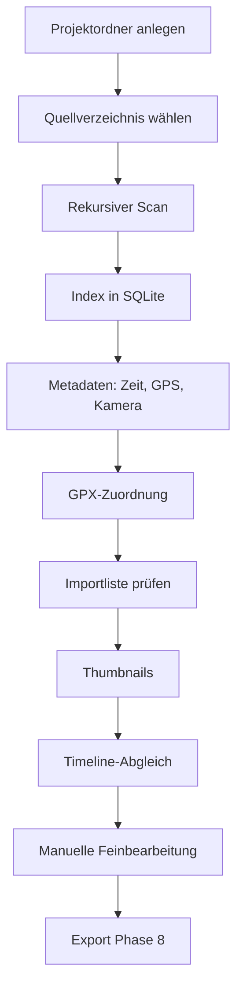

# Konzept — Reisetagebuch

| Feld | Inhalt |
| --- | --- |
| Version | 0.4 |
| Stand | 18. August 2026 |
| Status | Leitkonzept; Phase 7 (Timeline und Tagebuch) umgesetzt |
| Bezug | [pflichtenheft.md](pflichtenheft.md), [architecture.md](architecture.md) |

Dieses Dokument beschreibt die **Idee, den Ablauf und die technische Leitlinie**. Verbindliche Soll-Aussagen stehen im Pflichtenheft.

---

## 1. Produktidee

Reisende kommen mit einem Ordner voller Fotos, Videos, GPS-Tracks und Notizen nach Hause. Die Anwendung erzeugt daraus zuerst ein **Grundgerüst** — chronologisch, geografisch, mit erkennbaren Aufenthalten — und überlässt die Wahrheit dem Menschen: korrigieren, umsortieren, Texte schreiben, Fotos wählen.

Das Vorbild ist der *Workflow* von Polarsteps (Reise als Spur aus Orten und Momenten), nicht ein Online-Dienst. Es gibt kein Konto, keinen automatischen Upload, keine stillschweigende Cloud.

Zwei Nutzungswelten teilen denselben Kern:

| Anwendung | Fokus |
| --- | --- |
| **Reisetagebuch** (`traveljournal`) | Reise rekonstruieren, bearbeiten, exportieren |
| **PhotoInspector** (später) | Dubletten, Qualität, Auswahl — ohne Reisesemantik |

Deshalb liegt jede Analyse in `travelcore` und **nicht** in Qt-Widgets.

---

## 2. Leitprinzipien

1. **Originale sind heilig.** Die App liest Quelldateien nur. Schreiben geschieht ausschließlich im Projektordner.
2. **Vorschlag vor Entscheidung.** Automatik erzeugt `origin=auto`. Sobald der Benutzer eingreift, wird `origin=manual`. Automatik überschreibt manuelle Daten nicht still.
3. **Quelle der Wahrheit ist nachvollziehbar.** Jede Aufnahmezeit und jede Koordinate trägt ihre Herkunft (EXIF, QuickTime, Dateisystem, GPX-Interpolation/`gpx_nearest`, manuell).
4. **Keine falsche Präzision.** Fehlt die Zeitzone, bleibt sie unbekannt — es wird nicht „UTC“ unterstellt.
5. **Eine defekte Datei ist ein Datensatz, kein Absturz.**
6. **Lokal zuerst.** Externe Dienste nur nach ausdrücklicher Aktion.
7. **Schnittstellen vor konkreten Engines.** Metadaten, Karte, Export, Ranking und PDF-Rendering sind austauschbar.
8. **Keine toten Abhängigkeiten.** Eine Bibliothek wird erst installiert, wenn Code sie aufruft.

---

## 3. Nutzer und typische Abläufe

### 3.1 Erstimport einer Reise



Der Benutzer sieht während des Imports Fortschritt und danach **die vollständige Dateiliste** mit Aufnahmezeit, GPS und Kamera. Die Statistik (Fotos, Videos, Tracks, Texte, Fehler) und die Tabelle müssen dieselbe Grundmenge beschreiben. Nach dem Import entsteht automatisch die Timeline; Karte und Galerie lesen denselben Index.

### 3.2 Wiederholter Import

Dieselbe Quelle erneut analysieren:

- unveränderte Dateien (Größe + mtime + vorhandener Hash) nicht neu hashen
- fehlende GPS-/Kamera-/EXIF-Zeit nachziehen, wenn der Parser inzwischen mehr kann
- neue Dateien ergänzen
- defekte Dateien als Fehler zählen, Rest fortsetzen

### 3.3 Bearbeitung (Phase 7)

Das Grundgerüst entsteht **automatisch nach dem Import**, nicht als zweite Wahrheit in der Oberfläche.

- **Ein Reisetag je Kalendertag** der Aufnahmezeit (`captured_at.date()`). Medien ohne Zeit landen unter „Ohne Datum“.
- **Fotos werden nicht umgehängt.** Die Aufnahmezeit bleibt der Tag. Das Häkchen im Tagebuch setzt nur `used_in_journal` — wer ein Foto einem anderen Tag zuordnen will, ändert die Zeit nicht still, sondern wartet auf eine spätere, explizite Korrektur.
- **Ortsvorschläge** entstehen aus GPS-Fotos desselben Tages: greedy Cluster mit Haversine, Radius 150 m (`stay_radius_meters`). Sie bleiben unbestätigt (`origin=auto`), bis der Benutzer sie benennt, bestätigt oder löscht. Hat ein Tag bereits Orte, legt der Abgleich keine zweiten Auto-Orte an.
- **Übernachtungen** sind bewusst manuell (Tagebuch: Name, Ort, optional GPS, Beschreibung). Es gibt keine automatische Hotelerkennung.
- **Manuelle Daten überleben den Re-Sync:** Titel, Tagesetext, bestätigte Orte, Favoriten, Titelbild und Tagebuch-Häkchen tragen `origin=manual`. Die Automatik überschreibt sie nicht.
- **Timeline und Tagebuch** zeigen denselben Snapshot. Die Timeline bestätigt Orte; das Tagebuch schreibt Texte, setzt Fotos ins Buch und legt Übernachtungen an. Die Karte liest dieselben Orte und Übernachtungen.

### 3.4 PhotoInspector (später)

Öffnet keine Reisestruktur, sondern Medienbestände. Nutzt Hashing, Ähnlichkeit und Qualitätswerte aus `travelcore`. Darf Originale ebenfalls nicht ändern oder löschen.

---

## 4. Informationsarchitektur der Oberfläche

Linke Navigation, rechts der Arbeitsbereich. Sieben Seiten von Anfang an, auch wenn Fachlogik später nachzieht — so bleibt die mentale Karte der Anwendung stabil.

| Seite | Rolle im Konzept |
| --- | --- |
| **Projekt** | Behälter: Name, Ordner, Öffnen/Anlegen. Keine Medienbearbeitung. |
| **Import** | Brücke zur Außenwelt. Einzige Stelle, die das Quellverzeichnis scannt. |
| **Timeline** | Chronologische Wahrheit: Tage, Ereignisse, Ortsvorschläge bestätigen oder löschen. |
| **Karte** | Geografische Wahrheit: Track, Fotos, Orte, Übernachtungen. Backend austauschbar. |
| **Fotos** | Medienarbeit: Galerie, Filter, Favoriten. Qualität und Dubletten folgen später. |
| **Tagebuch** | Narrative Fassung: Titel, Text, Fotos ins Buch, Titelbild, Übernachtungen. |
| **Export** | Ausgabe, keine Analyse. Phase 8: HTML. |

Lange Arbeit (Index, Thumbnails, Qualität) läuft im GUI-Prozess über Worker, die **nur** synchrone `travelcore`-Funktionen aufrufen. Die Bibliothek kennt keine Qt-Threads.

---

## 5. Fachliches Datenmodell

### 5.1 Schichten der Reise

```
Reise
 └── Reisetag
      └── Reiseabschnitt
           └── Ort / Aufenthalt
                └── Ereignis
                     ├── Medienobjekt (Foto/Video)
                     └── Textnotiz
Übernachtung bezieht sich auf Tag + Ort (+ optionale Fotos)
```

Ortsnamen müssen in Version 1 nicht „perfekt“ sein. Die Struktur muss sie aber schon tragen, damit Automatik und Handarbeit dieselbe Hierarchie nutzen. **Reiseabschnitte** liegen im Datenmodell, werden in Phase 7 aber noch nicht erzeugt oder in der UI bearbeitet.

### 5.2 Position als eigener Fakt

Eine Position ist nie nur ein Koordinatenpaar. Sie hat:

- Quelle (`exif`, `quicktime`, später `gpx_interpolated`, `manual`)
- Konfidenz (1.0 bei direktem EXIF/ISO-6709; geringer bei Interpolation)
- optional Zeitdifferenz zum Track

Damit kann die UI später erklären: „aus dem Foto“ versus „aus der Uhrzeit auf dem GPX“.

### 5.3 Zeit als eigener Fakt

Gespeichert werden:

- Rohstring aus der Datei
- normalisierter Zeitpunkt
- Quellenname gemäß Prioritätsliste
- Zeitzonenname oder `timezone_unknown=true`

Dateisystemzeit ist letzter Fallback, nie stillschweigend als Aufnahmezeit ausgegeben ohne Kennzeichnung.

### 5.4 Projektordner

SQLite ist die Arbeitsdatei, nicht das Archiv der Bilder. Thumbnails und Analyseergebnisse liegen neben der Datenbank, damit das Projekt kopierbar bleibt. Die Quellwurzel der Originale steht in `settings.toml` (Projekt → Einstellungen), zusammen mit GPS-Zeitfenster, Standardzeitzone und Kartenanbieter (`leaflet` / `offline`). Wird der Ordner verschoben, setzt man den neuen Pfad; der Index wird umgeschrieben, die Originaldateien nicht. Zuletzt geöffnete Projekte merkt die App unter `%LOCALAPPDATA%\TravelJournal\recent.json`; die Liste erscheint in Phase 7 noch nicht in der Oberfläche.

---

## 6. Metadatenkonzept

Pillow liest JPEG/TIFF/WebP/PNG. HEIC öffnet Pillow in dieser Umgebung nicht; ExifTool ist optional und oft nicht installiert.

Deshalb liest `travelcore` HEIC **containerbasiert, nur lesend**:

1. Eingebettetes EXIF-TIFF (`Exif\0\0` bzw. gültiger TIFF-Kopf) → GPS-IFD, Make/Model, DateTimeOriginal
2. QuickTime/Apple ISO 6709 (`com.apple.quicktime.location.ISO6709`)
3. UTF-8-`data`-Boxen (Make/Model, typisch iPhone)
4. Optional ExifTool, falls vorhanden — füllt nur Lücken

Metadatenboxen in HEIC können **hinter** dem Bilddatenblock stehen. Ein Scan nur der ersten Megabytes ist konzeptionell falsch; gelesen wird die Datei vollständig (mit oberer Schutzgrenze und Kopf/Ende bei Extremgrößen).

RAW bleibt im Index ein Foto; tiefe Metadaten hängen an ExifTool. Videozeit hängt an einem späteren ffprobe-Adapter.

GPX-Tracks werden nach dem Dateiindex gelesen (gpxpy) und als Punkte mit Segment und Zeit gespeichert. Die GPX-Datei selbst bekommt eine repräsentative Position (arithmetisches Mittel der ersten Trackpunkte) und die Zeit des ersten Punkts mit `recorded_at` (`position_source` / `captured_at_source` = `gpx_track`), damit die Importliste Ort und Startzeit anzeigt. Originale GPX-Dateien bleiben unverändert. Fotos und Videos ohne geschützte EXIF-/QuickTime-Position erhalten eine interpolierte oder nächste Trackposition, wenn die Aufnahmezeit höchstens `gps_match_max_delta_seconds` (Standard 120) von den Nachbarpunkten entfernt ist. Quelle ist `gpx_interpolated` bzw. `gpx_nearest`, nie `exif`.

Naive Aufnahmezeiten ohne Offset werden nur für diesen Vergleich mit `default_timezone` des Projekts oder andernfalls UTC in Einklang mit GPX gebracht. Das Flag `timezone_unknown` an der Datei bleibt. KML und GeoJSON werden indexiert, aber noch nicht geparst.

Vorschaubilder entstehen beim Import in `thumbnails/` als quadratische JPEGs (Standard 256 px). Die Importliste wird während des Einlesens periodisch geschrieben und angezeigt, nach dem GPX-Abgleich noch einmal, erst danach laufen die Thumbnails. JPEG/PNG/WebP/TIFF liest Pillow. HEIC nutzt unter Windows dieselbe Vorschau wie der Explorer (`IShellItemImageFactory` / WIC, HEIF Image Extensions), sonst ein JPEG-Item oder ein eingebettetes JPEG im Container — ohne libheif und ohne GPL-Codecs. Die Galerie zeigt diese Caches, nicht die Originale. Ein zweiter Lauf überspringt vorhandene Dateien.

---

## 7. Technische Leitarchitektur

Details und Paketschnitt: [architecture.md](architecture.md).

```
apps/traveljournal     UI, Worker, keine Fachregeln
        │
        ▼
packages/travelcore    Scan, Index, Metadaten, GPS, Timeline, Karte, Export, DB
        ▲
apps/photoinspector    geplant, dieselbe Bibliothek
```

Wichtige Verträge (bereits angelegt, schrittweise gefüllt):

| Vertrag | Zweck |
| --- | --- |
| `MetadataProvider` | Pillow, ExifTool, später ffprobe |
| `Exporter` | HTML, PDF, LaTeX, CEWE |
| `MapBackend` | Folium zuerst, später ersetzbar |
| `RankingStrategy` | Foto-Score ohne fest verdrahtete Formel |

Persistenz: SQLAlchemy 2, Alembic, eine SQLite-Datei je Projekt. Migrationen sind Teil des Produkts, nicht nur der Entwicklung.

Nebenläufigkeit: Progress-Callbacks in `travelcore`, Threads nur in der App.

---

## 8. Exportkonzept

Export ist eine **Abbildung des bearbeiteten Tagebuchs**, nicht des Rohimports.

- **HTML zuerst:** eigenständige Seite, Jinja2, CSS getrennt, optional Karte.
- **PDF:** nicht über AGPL-Zwang (kein PyMuPDF als zentrale Abhängigkeit). Pfad HTML→Druckengine oder LaTeX→PDF hinter `PdfRenderer`.
- **LaTeX:** kompilierbares Projekt; der PDF-Lauf darf extern bleiben.
- **CEWE:** Schnittstelle und Platzhalter, bis das echte Format geprüft ist. Keine geratenen proprietären Binärformate.

---

## 9. Qualität, Ähnlichkeit, Ranking

Technische Qualität ist eine **Empfehlung**. Sie entscheidet nie über Löschen.

Ähnlichkeit ist eine eigene, GUI-freie Komponente:

- exakt: SHA-256
- visuell: dHash/pHash (später optionale Embeddings)

Ranking aggregiert Qualität, Schärfe, Auflösung, Einzigartigkeit und eine Dublettenstrafe. Die Formel ist eine Strategy, damit PhotoInspector und das Tagebuch unterschiedliche Gewichte nutzen können, ohne die Datenhaltung zu spalten.

---

## 10. Datenschutz und Lizenzrahmen

Standard: alles lokal. Kartenkacheln kommen optional von OpenStreetMap (`leaflet` in den Projekteinstellungen). `offline` zeichnet nur Track und Marker, ohne Kacheln. Reverse-Geocoding bleibt OP-01.

Abhängigkeiten: MIT/BSD/Apache bevorzugt, PySide6 unter LGPL mit dynamischem Linken. Jede direkte Bibliothek steht in [dependencies.md](dependencies.md). Persönliche GPS-Koordinaten gehören nicht ins Git-Repository; Tests verwenden synthetische Werte (z. B. Bozen als dokumentiertes Beispiel ohne Bezug zu echten Nutzerfotos).

---

## 11. Phasenlogik

Nicht das ganze Polarsteps-Abbild auf einmal. Jede Phase bleibt startbar und testbar.

| Phase | Konzeptueller Gewinn |
| --- | --- |
| 1–2 | Es gibt ein Projekt und einen Index. |
| 3 | Der Index hat eine zeitliche und geografische Bedeutung. |
| 4 | Fotos ohne EXIF-GPS stehen trotzdem auf der Spur. |
| 5 | Die Menge wird betrachtbar. |
| 6 | Die Reise wird räumlich erzählbar. |
| 7 | Der Mensch übernimmt die Redaktion. |
| 8 | Die Reise verlässt die App. |
| 9–10 | Die Auswahl wird begründet (Qualität, Dubletten). |

Aktueller Konzeptstand: **Phase 7** (Timeline und Tagebuch). HTML-Export folgt in Phase 8.
