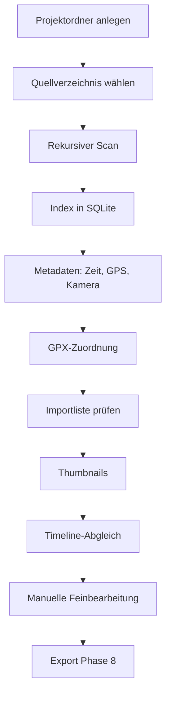

# Konzept — Reisetagebuch

| Feld | Inhalt |
| --- | --- |
| Version | 3.1 |
| Stand | 31. August 2026 |
| Status | Leitkonzept; Phase 7 plus Medien-Pipeline, Software **R3.1.0** |
| Bezug | [pflichtenheft.md](pflichtenheft.md), [architecture.md](architecture.md), [packaging/README.md](../packaging/README.md) |

Dieses Dokument beschreibt die **Idee, den Ablauf und die technische Leitlinie**. Verbindliche Soll-Aussagen stehen im Pflichtenheft.

---

## 1. Produktidee

Reisende kommen mit einem Ordner voller Fotos, Videos, GPS-Tracks und Notizen nach Hause. Die Anwendung erzeugt daraus zuerst ein **Grundgerüst** — chronologisch, geografisch, mit erkennbaren Aufenthalten — und überlässt die Wahrheit dem Menschen: korrigieren, umsortieren, Texte schreiben, Fotos wählen.

Das Vorbild ist der *Workflow* von Polarsteps (Reise als Spur aus Orten und Momenten), nicht ein Online-Dienst. Es gibt kein Konto, keinen automatischen Upload, keine stillschweigende Cloud.

Zwei Nutzungswelten teilen denselben Kern:

| Anwendung | Fokus |
| --- | --- |
| **Reisetagebuch** (`traveljournal`) | Reise rekonstruieren, bearbeiten, exportieren |
| **PhotoInspector** (später) | Dubletten, Qualität, Auswahl — ohne Reisesemantik |

Deshalb liegt jede Analyse in `travelcore` und **nicht** in Qt-Widgets.

---

## 2. Leitprinzipien

1. **Originale sind heilig.** Die App liest Quelldateien nur. Schreiben geschieht ausschließlich im Projektordner.
2. **Vorschlag vor Entscheidung.** Automatik erzeugt `origin=auto`. Sobald der Benutzer eingreift, wird `origin=manual`. Automatik überschreibt manuelle Daten nicht still.
3. **Quelle der Wahrheit ist nachvollziehbar.** Jede Aufnahmezeit und jede Koordinate trägt ihre Herkunft (EXIF, QuickTime, Dateisystem, GPX-Interpolation/`gpx_nearest`, manuell).
4. **Keine falsche Präzision.** Fehlt die Zeitzone, bleibt sie unbekannt — es wird nicht „UTC“ unterstellt.
5. **Eine defekte Datei ist ein Datensatz, kein Absturz.**
6. **Lokal zuerst.** Externe Dienste nur nach ausdrücklicher Aktion.
7. **Schnittstellen vor konkreten Engines.** Metadaten, Karte, Export, Ranking und PDF-Rendering sind austauschbar.
8. **Keine toten Abhängigkeiten.** Eine Bibliothek wird erst installiert, wenn Code sie aufruft.

---

## 3. Nutzer und typische Abläufe

### 3.1 Erstimport einer Reise



Der Benutzer sieht während des Imports Fortschritt und danach **die vollständige Dateiliste** mit Aufnahmezeit, GPS und Kamera. Klick oder Mouseover auf eine Zeile zeigt das gecachte Vorschaubild und die gespeicherten Metadaten. Die Statistik (Fotos, Videos, Tracks, Texte, Fehler) und die Tabelle müssen dieselbe Grundmenge beschreiben. Nach dem Import entsteht automatisch die Timeline; Karte und Galerie lesen denselben Index.

### 3.2 Wiederholter Import

Dieselbe Quelle erneut analysieren:

- unveränderte Dateien (Größe + mtime + vorhandener Hash) nicht neu hashen
- fehlende GPS-/Kamera-/EXIF-Zeit nachziehen, wenn der Parser inzwischen mehr kann
- neue Dateien ergänzen
- defekte Dateien als Fehler zählen, Rest fortsetzen

**Synchronisieren** (eigener Knopf neben „Dateien analysieren“) gleicht denselben Ordner mit dem Index ab:

- Dateien, die nicht mehr im Quellverzeichnis liegen, werden vollständig aus dem Tagebuch entfernt (Indexzeile, Timeline-Mitgliedschaft, Titelbild, GPS-Track und Punkte, Importfehler, Vorschaubilder). Originale schreibt die App nie.
- Für **neue** Fotos, Videos und Tracks wählt der Benutzer **In die Timeline** (Auto-Tage nach Aufnahmezeit, wie nach der Analyse) oder **In den Medienpool** (`parked`, keine Abschnittsmitgliedschaft).
- Ohne neue und ohne fehlende Dateien erscheint ein Hinweis; Metadaten nachziehen bleibt „Dateien analysieren“.

Polar-Trainings-JSON mit `routes` importiert die App nicht. Das Hilfsskript `scripts/json_routes_to_gpx.py` schreibt eine GPX-Datei neben die JSON-Datei (Aufruf und Kurzhilfe im [README](../README.md)).

### 3.3 Bearbeitung (Phase 7 plus Medien-Pipeline, Software R3.1.0)

Das Grundgerüst entsteht **automatisch nach dem Import**, nicht als zweite Wahrheit in der Oberfläche.

- **Ein Reisetag je Kalendertag** der Journal-Zeit (`journal_at.date()`), initialisiert aus der Aufnahmezeit. Jeder Tag ist ein Abschnitt mit Mitgliedern wie Aufenthalt und Transfer. Medien ohne Zeit landen unter „Ohne Datum“, bis sie auf der Timeline eine Uhr bekommen. Nicht zugeordnete Medien liegen im **Medienpool**, nicht als Resttage.
- **Reiseabschnitte** legt der Benutzer in der Timeline an: aus einer Mehrfachauswahl (Aufenthalt oder Transfer), ohne Auswahl als leeren Abschnitt (**Neuen Reiseabschnitt erstellen**: Tag mit **Am**, Aufenthalt/Transfer mit **Von Datum** / **Bis Datum**) oder über **+** auf der Linie zwischen zwei Karten bzw. zwischen den Leistenkarten auf der Karte (derselbe Dialog, Datum der Lücke vorausgefüllt). **Menü** **Datum…** bzw. **Zeitraum…** ändert die Spanne später; die Karte rutscht in der Timeline an die passende Stelle. Dateien ohne Abschnitt liegen im **Medienpool**. Der Typ (Tag, Transfer, Aufenthalt) ist an jeder Timeline-Karte änderbar. **Löschen** im **Menü** legt alle Medien in den Medienpool. Neu angelegte Abschnitte existieren nur im Speicher, bis Timeline-**Speichern**. **Zur Karte** an einem gespeicherten Abschnitt oder Tag öffnet die Karte und fokussiert die passende Karte in der Leiste. Rechtsklick auf ein Thumbnail mit Ort öffnet **Zur Karte…** in der Detailansicht an der Position des Bildes (Leistenkarte des Bildes in der Mitte). Ist die Karte schon geladen, bleibt das HTML.
- **Der Reisetitel** steht oben in der Timeline. Zuerst gilt der Projektname; nach Timeline-**Speichern** ist er manuell und überlebt den erneuten Abgleich.
- **Speichern in der Timeline** schreibt neue Abschnitte, Reisetitel, Titel/Texte und YouTube. Der Button ist nur dann aktiv, sonst grau; Rückgängig/Wiederherstellen dieser Edits schaltet ihn mit. **Timeline aktualisieren** schreibt geänderte Texte und den Reisetitel mit, persistiert aber keine Abschnitte und kein YouTube. Bewertungen, Eintrags-Titelbild an gespeicherten Einträgen und DHV-Leonardo an gespeicherten Einträgen speichern sofort und lassen **Speichern** inaktiv. Verlassen der Seite (oder Schließen des Fensters) fragt bei jedem solchen ungespeicherten Stand Speichern / Verwerfen / Abbrechen.
- **Zwei Uhren (R2.2.0):** Die Aufnahmezeit (`captured_at`) bleibt unverändert. Die Journal-Zeit (`journal_at` an der Mitgliedschaft) bestimmt die Position auf der Timeline. **Journal-Zeit…** verschiebt Clips; überschreitet die Uhr Mitternacht, wechselt der Clip den Tag. **Originalzeit** kopiert die Aufnahmezeit zurück. Im Pool entfällt die Journal-Zeit. Die Medien-Anzeigezeit (`media_at`, auch im Pool) folgt in der Medien-Pipeline, Abschnitt 9.1.
- **Ortsvorschläge** entstehen aus GPS-Fotos desselben Tages: greedy Cluster mit Haversine, Radius 150 m (`stay_radius_meters`). Sie bleiben unbestätigt (`origin=auto`), bis der Benutzer sie benennt, bestätigt oder löscht. Hat ein Tag bereits Orte, legt der Abgleich keine zweiten Auto-Orte an. Medien ohne GPS erben eine Anzeigeposition vom Abschnitt (Aufenthalt: Ort/Cover live; Tag: Cover-Pin als Snapshot; Transfer: Track bei Journal-Zeit), ohne Original-GPS zu überschreiben. Beim Verschieben auf einen Abschnitt (aus dem Pool oder von einer anderen Karte) fragt die Timeline, ob vorhandenes GPS auf der Karte bleiben soll oder die Abschnittsposition gilt (mehrere Medien leicht versetzt). Die Journal-Zeit übernimmt das Datum bzw. die Spanne des Zielabschnitts. Ziehen auf den Pool parkt. Am Fenster- bzw. Spaltenrand scrollt die Timeline während des Ziehens.
- **Rückgängig / Wiederherstellen** gilt für die Journal-Redaktion, nicht für den Import. **Bearbeiten → Rückgängig** (**Strg+Z**) und **Wiederherstellen** (**Strg+Y**) nehmen Zuordnen, Parken, Bewerten, Drehen, Abschnitt anlegen/löschen/auflösen, Typ, Datum, Kartenposition, Ausblenden, Journal-Zeit, Titel, Tagebucheintrag, Reisetitel und Eintrags-Titelbild zurück. In einem fokussierten Textfeld gilt zuerst die Widget-Historie (Zeichen für Zeichen); erst danach der Anwendungsstack. Import, Synchronisieren, Timeline aktualisieren, Projekt öffnen/schließen und Einstellungen leeren den Stack — sie sind Batch-Operationen, keine invertierbaren Einzeledits. YouTube, DHV-Leonardo und Orte bleiben außerhalb.
- **Manuelle Daten überleben den Re-Sync:** Titel, Tagesetext, bestätigte Orte, Favoriten, Sortierstatus, Titelbild und `used_in_journal` tragen `origin=manual`. Die Automatik überschreibt sie nicht. Anzeigedrehung (`rotation_degrees`) überlebt den Re-Import.
- **Die Timeline** ist die Bearbeitungsoberfläche: sie mischt Tage, Transfers und Aufenthalte. Jede Karte hat links ein Titelbild (Thumbnail-Größe), rechts zuerst den Titel, darunter Typ und Datum (`12.12.2026` oder `11.11.2026 - 21.11.2026`), **Zur Karte** und **Menü**, danach die Verbindungslinien (Transfer: verschiebbare Liste mit Geometrie, Strich und Verkehrsmittel; Tag/Aufenthalt: eine Ausgangslinie zum nächsten Nicht-Transfer oder **Keine Linie**), darunter den Tagebucheintrag. Oben rechts auf Höhe von **Titel** sitzt der Sichtbarkeits-Schalter (Pille ohne Text; ein = auf Karte und im Export, aus = nur in der Timeline). Ausgeschaltet bleibt der Abschnitt in der Timeline und fehlt auf Karte und im Export. Hilfe **Verkehrsmittelsymbole** zeigt denselben Katalog wie die Auswahl (Nase nach rechts; Camper und Camper Van im Katalog gespiegelt). Sie schreibt Titel und Texte, setzt Bewertungen (dieselben wie auf der Medienseite) und Eintrags-Titelbilder (Foto oder Track), speichert YouTube erst mit **Speichern** und DHV-Leonardo-Links an gespeicherten Einträgen sofort. Am vertikalen Schieber erscheint beim Scrollen das Datum des Abschnitts in der Bildmitte; am Pool-Schieber das Aufnahmedatum des Mediums in der Bildmitte. Zwischen den Karten liegt eine schlanke senkrechte Linie mit **+** in einem Ring in der Mitte (Farbe wie die Verbindungslinien auf der Karte); Klick auf **+** öffnet den Dialog zum Anlegen und füllt das Datum der Lücke vor. Die Karte zeigt dieselben Einträge als Titelbilder plus eine Leiste darunter (Tag mit Kalendersymbol, Transfer als liegendes Sechseck, Aufenthalt als bisherige Karte); zwischen den Leistenkarten sitzt dasselbe **+**; zwischen Tag- und Aufenthaltskreisen verbindet die Transfer-Liste oder die Ausgangslinie die Positionen (Verkehrssymbol in Fahrtrichtung oder Richtungspfeil), solange sie sich nicht überdecken. Die Detailansicht liest dieselben Orte und blendet die Verbindungslinien aus. Einfachklick in der Leiste zentriert, Doppelklick öffnet den Eintrag in der Timeline (Oberkante bündig unter der Werkzeugleiste, nicht die Kartenmitte). Oben auf den Leistenkarten stehen Zähler für Fotos, GPX-Tracks, IGC-Flüge und YouTube (Reserve nur bei eingeschalteter Reserve-Anzeige). Rechts neben der Karte erscheint der Tagebucheintrag der fokussierten Karte (editierbar; nach Änderung Speichern, Abbrechen, Verwerfen; beim Wechsel der Leistenkarte als Dialog). YouTube-Vorschaubilder liegen unten rechts auf der Karte übereinander.
- **Medien-Vorauswahl (R3.0.0):** Auf der Medienseite stapeln **Dubletten stapeln** echte Kopien (SHA-256, sofort akzeptiert, Kennzeichen ×n). **Ähnliche gruppieren** schlägt Szenengruppen im 30-s-Fenster vor; **Auswahl gruppieren** und Rechtsklick **Gruppieren** (Medien und Timeline) legen manuelle Gruppen ohne Schlüssel an. **Gruppe auflösen** entfernt nur die Gruppe. Schlüsselfotos setzt der Inspektor. Unten zählt die Statistikleiste den projektweiten Bestand (Abschnitt 9.4). **Qualität prüfen** setzt die Ampel (Abschnitt 9.2). **Filtern** schränkt Galerie und Pool nach Ampel, Zeitraum und Bewertung ein (Abschnitt 9.5). Unechte Dubletten (pHash) bleiben geplant.
- **Medieninspektor:** In der Timeline öffnet ein Doppelklick ein eigenes Fenster mit dem Original. Fotos und Tracks tragen dieselbe Bewertung (Register, Inspektor, Karten-Popup). Auf der Karte zeigt ein Klick auf ein einzelnes Foto zuerst ein Thumbnail-Popup; die Karte steht vorher so, dass großes Bild, kleines Karten-Thumb und Datum gemeinsam zentriert sind. Pfeile und Pfeiltasten blättern mit Wrap-around, ohne den Thumbnail-Modus zu verlassen; nur ein Klick in die freie Karte beendet ihn. Der Thumbnail-Schieber der Kartenseite ändert nur die große Popup-Vorschau. Doppelklick auf das Thumbnail öffnet denselben Inspektor. Liegen Fotos in der Detailansicht sehr nah beieinander, werden sie gestapelt (Anzahl auf dem Marker); ab Zoom 17 liegen sie einzeln übereinander, Fotokegel bleiben sichtbar. Klick auf den Stapel fächert die Bilder rund auseinander, ohne Fotokegel; der Fächer bleibt. Klick auf ein Bild im Fächer blendet die anderen aus und setzt Bild und Kegel an die Originalposition; ein weiterer Klick öffnet das Thumbnail. Blättern im Popup funktioniert auch, wenn der Stapel bei niedrigerem Zoom noch nicht aufgelöst ist. Ein Zahnrad unter den Zoom-Buttons schaltet Fotokegel (Richtung und Brennweite ab Zoom 17), Reserve-Medien sowie Ortsnamen und Straßen auf dem Satelliten (gespeichert im Projekt); dazwischen sitzt **Ganze Reise**. Aussortierte erscheinen nie. Cover-Kreise: erster Klick zoomt auf den Kreis (bei Überlappung zuerst die Gruppe); zweiter Klick öffnet das Detail. In der Detailansicht schließt ein Klick auf eine andere Leistenkarte das Detail und zoomt auf deren Abschnitt (Mauszeiger folgt zur Mitte); die aktuelle Leistenkarte lässt das Detail offen. Blättern in der Sequenz des Tags/Abschnitts, Bewertung springt zum nächsten Eintrag, **In den Pool** ebenfalls (letzter bleibt), Zoom, freie Fenstergröße (bleibt beim nächsten Öffnen), Vollbild mit schwarzen Rändern, Anzeigedrehung ohne Originalschreiben. In einer Gruppe: Links/rechts durch Einzelbilder und alle Schlüsselfotos, hoch/runter durch alle Mitglieder; im Stapel wirkt hoch/runter nicht. Das Kennzeichen G bzw. ×n sitzt groß oben rechts auf dem Foto (dunkle Platte, nicht klickbar). Die Checkbox **Aussortierte anzeigen** gilt nur fürs Inspektor-Blättern. Mehrere Original-Fenster können gleichzeitig offen bleiben (versetzt). **Zur Karte** öffnet dasselbe Detail wie der Thumbnail-Menüpunkt (nur mit Kartenposition): Detailmodus, Foto-Popup, zugehörige Leistenkarte in der Mitte; der letzte Klick gewinnt. Ist die Karte schon geladen, ohne Neuaufbau. **In den Pool** legt das aktuelle Medium in den Medienpool, **Zurückholen** ordnet es wieder zu.

### 3.4 PhotoInspector (später)

Öffnet keine Reisestruktur, sondern Medienbestände. Nutzt Hashing, Ähnlichkeit und Qualitätswerte aus `travelcore`. Darf Originale ebenfalls nicht ändern oder löschen.

---

## 4. Informationsarchitektur der Oberfläche

Linke Navigation, rechts der Arbeitsbereich. Die Pipeline (Projekt, Import, Medien, Timeline, Karte, Export) hat vor jedem Eintrag ein Symbol; eingeklappt sind nur die Symbole sichtbar, ausgeklappt ist die Leiste so breit wie der Inhalt.

| Seite | Rolle im Konzept |
| --- | --- |
| **Projekt** | Behälter: Name, Ordner, Öffnen/Anlegen. Keine Medienbearbeitung. |
| **Import** | Brücke zur Außenwelt. Einzige Stelle, die das Quellverzeichnis scannt. Analyse ergänzt; Synchronisieren entfernt Fehlende und fragt Timeline oder Pool für Neue. Thumbnail-Schieber skaliert die rechte Dateivorschau. |
| **Medien** | Vorauswahl und Vorbereitung vor der Chronik: links Reise-Galerie, rechts Medienpool, Register Alle/Favoriten/Reserve/Aussortiert, Filter inkl. **Filtern** (Qualität, Zeitraum, Bewertung), Bewertungen, Inspektor, **Dubletten stapeln** / **Ähnliche gruppieren** / **Auswahl gruppieren**, Kennzeichen G/×n, Statistikleiste, **Qualität prüfen** (Ampel unten links; Hover begründet gelb/rot). Geplant: unechte Dubletten (pHash). Siehe Abschnitt 9. |
| **Timeline** | Chronologische und narrative Bearbeitung: Reisetitel, Tage, Transfers und Aufenthalte, Sichtbarkeits-Schalter (ein = Karte/Export, aus = nur Timeline), einblendbare Pool-Spalte rechts über die volle Höhe (eigenes Bewertungsregister), Typwahl, Titel/Text, Bewertungen, Eintrags-Titelbild, YouTube/DHV-Leonardo, **Speichern** nur bei ungespeicherten Abschnitten/Texten/Reisetitel/YouTube (sonst grau), beim Verlassen Speichern/Verwerfen/Abbrechen, **Rückgängig / Wiederherstellen** (Strg+Z / Strg+Y), Medieninspektor. |
| **Karte** | Geografische Wahrheit: ein runder Kreis je Tag, Transfer oder Aufenthalt (ausgeblendete Abschnitte fehlen, Nachbarn rücken zusammen); zwischen Tag- und Aufenthaltskreisen Verbindungslinien in Timeline-Reihenfolge (Transfer-Liste oder Ausgangslinie, Symbolspitze zum Folgekreis, ausgeblendet, wenn sich die Kreise überdecken). Der Transfer-Kreis hängt mit einer dünnen Linie am Verkehrssymbol. Erster Klick auf einen Kreis zoomt darauf (überlappende Kreise zuerst als Gruppe); zweiter Klick zeigt Fotos, Videos, Tracks und Orte. **Ganze Reise** passt alle Kreise ein. Die Leiste unter der Karte folgt dem Reiseverlauf — Einfachklick in der Übersicht zentriert bei gleichem Zoom, in der Detailansicht schließt er das Detail und zoomt auf den Abschnitt; Doppelklick öffnet die Timeline. Ohne Eintrags-Titelbild das erste Foto, sonst das erste Track-Thumbnail, sonst das erste YouTube-Vorschaubild. Abschnitte ohne Position haben in der Leiste einen roten Rand; Rechtsklick **Platzieren**, **Verschieben** (Fadenkreuz, Zoom und Fokus bleiben) oder **Zentrieren** (schwenkt und zoomt auf den Kreis). Backend austauschbar. |
| **Export** | Ausgabe, keine Analyse. Phase 8: HTML. Ausgeblendete Abschnitte fehlen wie auf der Karte. |

Lange Arbeit (Index, Thumbnails, Qualität) läuft im GUI-Prozess über Worker, die **nur** synchrone `travelcore`-Funktionen aufrufen. Die Bibliothek kennt keine Qt-Threads. CPU-Arbeit (Hash, Metadaten, Vorschaubilder) parallelisiert `travelcore` intern per Prozess-Pool; SQLite bleibt ein Schreiber.

---

## 5. Fachliches Datenmodell

### 5.1 Schichten der Reise

```
Reise
 └── Journal-Einträge (`trip_sections`), chronologisch gemischt
      ├── Tag (genau ein Kalendertag, Mitglieder)
      ├── Aufenthalt (Spanne, Mitglieder)
      └── Transfer (Spanne, Verbindungslinien, Mitglieder)
           └── Ort / Ereignis / Medien / Text
 Medienpool: geparkte Dateien ohne Abschnittsmitgliedschaft
 Kalendertage (`TripDay`): Gerüst für Orte, Auto-Ereignisse und Importtexte
```

Ortsnamen müssen in Version 1 nicht „perfekt“ sein. Die Struktur muss sie aber schon tragen, damit Automatik und Handarbeit dieselbe Hierarchie nutzen. **Tag, Aufenthalt und Transfer** sind nach dem Design-Review dieselbe interne Struktur (`SectionMember`). Beim ersten Einlesen entstehen Auto-Tage nach Aufnahmedatum. Der Begriff Resttag entfällt. Reiseabschnitte gehören zur Chronologie, nicht zur automatischen Import-Gruppierung über Ortscluster hinaus.

### 5.2 Position als eigener Fakt

Eine Position ist nie nur ein Koordinatenpaar. Sie hat:

- Quelle (`exif`, `quicktime`, `photo_nearest`/`photo_interpolated`, `gpx_interpolated`/`gpx_nearest`, `igc_interpolated`/`igc_nearest`, `manual`)
- Konfidenz (1.0 bei direktem EXIF/ISO-6709; geringer bei Interpolation)
- optional Zeitdifferenz zum Track

Damit kann die UI später erklären: „aus dem Foto“ versus „aus der Uhrzeit auf dem GPX“.

### 5.3 Zeit als eigener Fakt

Gespeichert werden:

- Rohstring aus der Datei
- normalisierter Zeitpunkt
- Quellenname gemäß Prioritätsliste
- Zeitzonenname oder `timezone_unknown=true`

Dateisystemzeit ist letzter Fallback, nie stillschweigend als Aufnahmezeit ausgegeben ohne Kennzeichnung.

Geplant (Medien-Pipeline): eine dritte Uhr **`media_at`** (Medien-Anzeigezeit) am Medium, auch im Pool. Sie steuert die Timeline-Zuordnung. `captured_at` bleibt das Original. `journal_at` an der Mitgliedschaft wird daraus initialisiert und bleibt die Feinjustierung auf der Karte. Siehe Abschnitt 9.1.

### 5.4 Projektordner

SQLite ist die Arbeitsdatei, nicht das Archiv der Bilder. Thumbnails und Analyseergebnisse liegen neben der Datenbank, damit das Projekt kopierbar bleibt. Die Quellwurzel der Originale steht in `settings.toml` (Projekt → Einstellungen), zusammen mit GPS-Zeitfenster, Standardzeitzone, Kartenanbieter (`leaflet` / `offline`) und der Farbe der Verbindungslinien auf der Karte (Standard weiß). Wird der Ordner verschoben, setzt man den neuen Pfad; der Index wird umgeschrieben, die Originaldateien nicht. Zuletzt geöffnete Projekte merkt die App unter `%LOCALAPPDATA%\TravelJournal\recent.json`; die Liste erscheint noch nicht in der Oberfläche. Das Medienregister (`timeline_media_tab`, Timeline und Medienseite), die Thumbnail-Schieber (`timeline_thumb_zoom`, `map_thumb_zoom`, `media_thumb_zoom`, `import_thumb_zoom`), die eingeklappte Navigation (`sidebar_collapsed`), der Medienpool (`timeline_pool_visible`, `pool_width`), die Inspektor-Fenstergröße (`inspector_width`, `inspector_height`, `inspector_maximized`) und der Projekte-Stammordner liegen in `config.json`. Der Fenstertitel zeigt die Softwareversion (`Reisetagebuch R3.1.0` bzw. mit Projekttitel). `inspector_show_rejected` steuert die Inspektor-Checkbox **Aussortierte anzeigen**.

---

## 6. Metadatenkonzept

Pillow liest JPEG/TIFF/WebP/PNG. HEIC öffnet Pillow in dieser Umgebung nicht; ExifTool ist optional und oft nicht installiert.

Deshalb liest `travelcore` HEIC **containerbasiert, nur lesend**:

1. Eingebettetes EXIF-TIFF (`Exif\0\0` bzw. gültiger TIFF-Kopf) → GPS-IFD (inkl. Blickrichtung), Make/Model, DateTimeOriginal, Brennweite / 35-mm-Äquivalent
2. QuickTime/Apple ISO 6709 (`com.apple.quicktime.location.ISO6709`)
3. UTF-8-`data`-Boxen (Make/Model, typisch iPhone)
4. Optional ExifTool, falls vorhanden — füllt nur Lücken

Metadatenboxen in HEIC können **hinter** dem Bilddatenblock stehen. Ein Scan nur der ersten Megabytes ist konzeptionell falsch; gelesen wird die Datei vollständig (mit oberer Schutzgrenze und Kopf/Ende bei Extremgrößen).

RAW bleibt im Index ein Foto; tiefe Metadaten hängen an ExifTool. Videozeit hängt an einem späteren ffprobe-Adapter.

GPX-Tracks werden nach dem Dateiindex gelesen (gpxpy) und als Punkte mit Segment und Zeit gespeichert. Unveränderte GPX/IGC (Größe, mtime, Hash) werden nicht erneut geparst und nicht neu in SQLite geschrieben, sofern bereits Trackpunkte existieren. IGC-Fluglogs (Gleitschirm) werden ebenfalls gelesen: B-Records als Trackpunkte, Pilot aus dem Header, optionaler DHV-Leonardo-Link am Track (beim Re-Import erhalten). Die Trackdatei selbst bekommt eine repräsentative Position (arithmetisches Mittel der ersten Trackpunkte) und die Zeit des ersten Punkts mit `recorded_at` (`gpx_track` / `igc_track`). Originale bleiben unverändert. Fotos und Videos ohne geschützte EXIF-/QuickTime-Position erhalten eine Position in dieser Reihenfolge: (1) zeitnahes anderes Foto mit GPS, (2) GPX, (3) IGC, jeweils interpoliert oder nächster Punkt innerhalb `gps_match_max_delta_seconds` (Standard 120). Quellen: `photo_interpolated`/`photo_nearest`, `gpx_interpolated`/`gpx_nearest`, `igc_interpolated`/`igc_nearest`, nie `exif`. Foto-, Video-, GPX- und IGC-Positionen bekommen keinen Ortsnamen; auf der Karte steht das Datum.

Naive Aufnahmezeiten ohne Offset werden nur für diesen Vergleich mit `default_timezone` des Projekts oder andernfalls UTC in Einklang mit GPX/IGC gebracht. Das Flag `timezone_unknown` an der Datei bleibt. KML (LineString / gx:Track) und GeoJSON (LineString) werden für Track-Vorschauen geparst; sie fließen nicht in die GPS-Zuordnung und nicht in die interaktive Karte.

Vorschaubilder entstehen beim Import in `thumbnails/` als quadratische JPEGs (Standard 256 px). Die Importliste wird während des Einlesens periodisch geschrieben und angezeigt, nach dem GPX-Abgleich noch einmal, erst danach laufen die Thumbnails. JPEG/PNG/WebP/TIFF liest Pillow. Sehr große JPEGs (z. B. 48-MP-Smartphone-Fotos) werden per `Image.draft` in reduzierter Auflösung dekodiert, damit der Thumbnail-Cache sie nicht überspringt; PNG/TIFF über der Pixelgrenze bleiben ohne Vorschau. HEIC nutzt unter Windows dieselbe Vorschau wie der Explorer (`IShellItemImageFactory` / WIC, HEIF Image Extensions), sonst ein JPEG-Item oder ein eingebettetes JPEG im Container — ohne libheif und ohne GPL-Codecs. GPS-Tracks (GPX/IGC/KML/GeoJSON) zeichnen die Spur rot auf einem OSM-Kartenausschnitt (`cache/map_tiles`); ohne Kacheln bleibt der Hintergrund schwarz. Die Galerie zeigt diese Caches, nicht die Originale. Ein zweiter Lauf überspringt vorhandene Dateien.

Anzeigedrehung ist ein Index-Fakt (`source_files.rotation_degrees`, 0/90/180/270). Sie greift nach der EXIF-Orientierung, nur auf Vorschau und Inspektor. Originale werden nicht geschrieben. Der Thumbnail-Cachepfad enthält die Drehung (`_r90`), damit ein Re-Import die Nutzerdrehung nicht überschreibt.

---

## 7. Technische Leitarchitektur

Details und Paketschnitt: [architecture.md](architecture.md).

```
apps/traveljournal     UI, Worker, keine Fachregeln
        │
        ▼
packages/travelcore    Scan, Index, Metadaten, GPS, Timeline, Karte, Export, DB
        ▲
apps/photoinspector    geplant, dieselbe Bibliothek
```

Wichtige Verträge (bereits angelegt, schrittweise gefüllt):

| Vertrag | Zweck |
| --- | --- |
| `MetadataProvider` | Pillow, ExifTool, später ffprobe |
| `Exporter` | HTML, PDF, LaTeX, CEWE |
| `MapBackend` | Folium zuerst, später ersetzbar |
| `RankingStrategy` | Foto-Score ohne fest verdrahtete Formel |

Persistenz: SQLAlchemy 2, Alembic, eine SQLite-Datei je Projekt. Migrationen sind Teil des Produkts, nicht nur der Entwicklung.

Nebenläufigkeit: Progress-Callbacks in `travelcore`, Qt-Threads nur in der App. CPU-Pools in der Bibliothek, SQLite seriell.

### 7.1 Verteilung an Endnutzer

Zwei Betriebsarten, dieselbe Fachlogik:

| Wer | Start |
| --- | --- |
| Entwicklung | Python 3.12-venv, `python -m traveljournal` |
| Endnutzer (Windows) | `Reisetagebuch.exe` aus dem Frozen-Ordner, dem Zip oder dem optionalen Inno-Setup |

Das Frozen-Paket ist **onedir** (Ordner plus EXE), nicht eine einzige Datei: Qt WebEngine (Karte) und der ProcessPool (`spawn`) sind so zuverlässiger. Der Frozen-Einstieg `packaging/entry.py` ruft `multiprocessing.freeze_support` auf, **ohne** `traveljournal.main` zu ändern — sonst würden Worker-Prozesse weitere GUI-Fenster öffnen.

Die Installation (Setup) schreibt nur nach `%LOCALAPPDATA%\Programs\Reisetagebuch`. Reiseprojekte bleiben eigene Ordner; App-Einstellungen bleiben unter `%LOCALAPPDATA%\TravelJournal`. Originale liegen weiterhin außerhalb des Installationsordners.

**Nicht** im Paket: ExifTool, HEIF Image Extensions, FFmpeg. **Nicht** vorgesehen: macOS (WIC-Vorschauen, `%LOCALAPPDATA%`). PySide6 bleibt dynamisch gelinkt (LGPL); `NOTICE.txt` liegt im Paket. Eine Code-Signatur fehlt noch — SmartScreen kann die unsignierte EXE beim ersten Start beanstanden.

Build: [packaging/README.md](../packaging/README.md).

---

## 8. Exportkonzept

Export ist eine **Abbildung des bearbeiteten Tagebuchs**, nicht des Rohimports.

- **HTML zuerst:** eigenständige Seite, Jinja2, CSS getrennt, optional Karte.
- **PDF:** nicht über AGPL-Zwang (kein PyMuPDF als zentrale Abhängigkeit). Pfad HTML→Druckengine oder LaTeX→PDF hinter `PdfRenderer`.
- **LaTeX:** kompilierbares Projekt; der PDF-Lauf darf extern bleiben.
- **CEWE:** Schnittstelle und Platzhalter, bis das echte Format geprüft ist. Keine geratenen proprietären Binärformate.

---

## 9. Medien-Pipeline: Vorbereitung, Qualität, Stapel und Gruppe

Die Seite **Medien** ist die Vorauswahl-Station zwischen Import und Chronik. Import indexiert; Medien bereitet vor und verdichtet; Timeline, Karte und Export erzählen den redigierten Bestand. Analyse und Gruppierung liegen in `travelcore` (Phasen 9/10), nicht in den Widgets. Originale werden weder geändert noch gelöscht. „Nur ein Medium behalten“ bedeutet: im Tagebuch gilt der Vertreter, die Datei bleibt im Index.

### 9.1 Vorbereitung und Medien-Anzeigezeit

In Medien können Medien vor der Chronik gerichtet werden. Aktionen laufen ausdrücklich (Knopf), nicht still nach dem Import — Ausnahme: echte SHA-256-Dubletten (Aktion 1) erzeugen sofort einen akzeptierten Stapel.

Drei Uhren:

| Uhr | Wo | Rolle |
| --- | --- | --- |
| `captured_at` | Medium | Original-Aufnahmezeit, unveränderlich |
| `media_at` | Medium, **auch im Pool** | Medien-Anzeigezeit. Steuert die **Timeline-Zuordnung** (welcher Tag / ob „Ohne Datum“). Initial gleich `captured_at`. In Medien setzbar. |
| `journal_at` | Mitgliedschaft | Feinjustierung auf der Timeline-Karte; wird beim Zuordnen aus `media_at` initialisiert. **Journal-Zeit…** und **Originalzeit** bleiben. |

Drehung und Bewertung bleiben Vorbereitung wie bisher.

### 9.2 Aktionen

| Aktion | Zweck | Ergebnis | Übernahme | Stand R3.0.0 |
| --- | --- | --- | --- | --- |
| 1 Echte Dubletten | Gleicher Dateiinhalt (SHA-256, bereits im Index) | **Stapel**, ein Schlüsselfoto | **sofort akzeptiert** | umgesetzt |
| 2 Unechte Dubletten | Visuell dasselbe Bild bei anderem Hash (WhatsApp, andere Auflösung/Metadaten/Name) | ebenfalls **Stapel** | vorschlagen, dann bestätigen | geplant (pHash) |
| 3 Qualität | Unscharf, verkehrt belichtet, sehr geringe Auflösung | **Ampel** am Medium (grün / gelb / rot) | nur Kennzeichen, kein Aussortieren, kein Löschen | umgesetzt |
| 4 Ähnliche gruppieren | Zeit, Ort, Blickwinkel, ähnlicher Ausschnitt — nicht dasselbe Bild | **Gruppe** mit einem oder mehreren Schlüsselfotos | Dialog, dann bestätigen | teilweise (30-s-Zeitfenster; kein pHash/Ort) |
| 5 Auswahl gruppieren | Vom Benutzer gewählte Fotos | **Gruppe**, ohne Schlüsselfoto | Knopf in Medien oder Rechtsklick **Gruppieren** in Medien und Timeline; Schlüsselfotos danach im Inspektor | umgesetzt |

Lange Läufe nutzen dieselben Worker und den Process-Pool wie der Import; SQLite bleibt ein Schreiber.

Die Ampel ist eine abgeleitete Empfehlung aus `technical_quality` (grün ab 0,66, gelb ab 0,40, darunter rot; geringe Auflösung, Unschärfe oder starke Über-/Unterbelichtung deckeln den Wert). Sie ändert `sort_status` nicht und überstimmt weder Favorit noch Titelbild. Knopf **Qualität prüfen** auf Medien; bereits bewertete Fotos werden übersprungen. Die Scheibe sitzt unten links am Thumbnail (Medien und Timeline). Der Hover zeigt „Qualität gut/mittel/schwach“. Bei gelb oder rot folgt eine zweite Zeile mit den Werten, die die Farbe erklären (Auflösung, Schärfe, Belichtung mit über-/unterbelichtet, Kontrast). Grün bleibt nur die Überschrift. Die Einzelwerte kommen aus `photo_analyses`, ohne das Original erneut zu lesen.

### 9.3 Stapel und Gruppe

Zwei Cluster-Typen. Aktion-1-Stapel sind sofort akzeptiert. Übrige Vorschläge tragen `origin=auto`, bis der Benutzer sie bestätigt (`origin=manual`). Ein Medium liegt in höchstens einem Stapel. Ein Stapel (über sein Schlüsselfoto) oder ein Einzelbild darf in einer Gruppe liegen.

**Stapel** — vermeintlich dasselbe Bild (echte und unechte Dubletten):

- Genau **ein** Schlüsselfoto, automatisch das beste Exemplar per Ranking (Auflösung, Schärfe, vorhandene Original-Metadaten; WhatsApp-Kopien weichen dem Original).
- Der Schlüssel ist später wechselbar (Stapel öffnen, anderes Mitglied wählen).
- **Versteckte Mitglieder bleiben im Stapel.** Sie werden weder aus dem Index genommen noch auf Aussortiert gesetzt noch in den Pool verschoben. Bewertung und Abschnittszugehörigkeit bleiben.
- In Galerie, Timeline, Karte und Export erscheint nur das Schlüsselfoto, mit einem Kennzeichen (z. B. Stapelzahl).
- **Klick auf das Stapel-Kennzeichen** öffnet den Original-Inspektor. Links/rechts blättert durch die Galerie (Einzelbilder und Schlüsselfotos). Hoch/runter gilt nur in einer Gruppe. **Schlüsselfoto** oder die Leertaste setzt das eine Schlüsselbild.

**Gruppe** — sehr ähnliche, aber nicht identische Bilder (Serie, leichter Schwenk, gleicher Ort/Zeit/Ausschnitt):

- Darf **mehrere Schlüsselfotos** haben.
- Die Schlüsselfotos wählt der Benutzer im **Original-Inspektor** (nicht automatisch allein): **Links/rechts** blättert durch Einzelbilder und **alle** Schlüsselfotos der Gruppe, nicht durch die übrigen Mitglieder. **Hoch/runter** (oder ▲▼) blättert nur innerhalb der Gruppe. **Schlüsselfoto** oder die Leertaste schaltet das aktuelle Bild ein oder aus (mehrere möglich). Öffnen legt kein Schlüsselfoto fest. Am Original sitzt das Gruppen- oder Stapel-Kennzeichen oben rechts.
- Sind Schlüsselfotos gewählt, ist das **Gruppen-Kennzeichen grün**. Ohne Schlüssel trägt jede Gruppe eine eigene Farbe, damit die Mitglieder in der Galerie zusammengehören.
- Nach der Auswahl bleiben **nur die Schlüsselfotos** sichtbar, jedes mit dem Kennzeichen.
- Nicht gewählte Mitglieder bleiben im Index und in der Gruppe, sind aber in der normalen Galerie, Timeline, Karte und im Export unsichtbar, bis die Gruppe wieder geöffnet wird.

```
Gruppe „Marktplatz 14:02“   (Dialog: zwei Schlüssel gewählt)
 ├── Schlüssel 1  [Kennzeichen Gruppe]     ← sichtbar
 ├── Schlüssel 2  [Kennzeichen Gruppe]     ← sichtbar
 ├── Stapel A     (ein Schlüssel, ×3)      ← nur sichtbar, falls als Schlüssel gewählt
 └── übrige Serienfotos                    ← verborgen, bleiben in der Gruppe
```

**Klick auf das Gruppen-Kennzeichen** öffnet denselben Original-Inspektor erneut (hoch/runter erreicht auch die verborgenen Mitglieder). **Gruppe auflösen** (Rechtsklick) entfernt die Gruppe; die Fotos bleiben im Index und werden wieder einzeln sichtbar.

Technische Ähnlichkeit bleibt GUI-frei: exakt SHA-256, visuell dHash/pHash, später optionale Embeddings. Ranking (Qualität, Schärfe, Auflösung, Einzigartigkeit, Dublettenstrafe) ist eine Strategy — PhotoInspector und Tagebuch können andere Gewichte nutzen. Das Schlüsselfoto eines Stapels folgt diesem Ranking, bis es im Inspektor gewechselt wird. Eine manuelle Auswahl-Gruppe hat zunächst kein Schlüsselfoto; die Schlüssel setzt nur der Inspektor.

### 9.4 Statistikleiste Medien

Unten auf der Medienseite, volle Breite, unabhängig von Suche/Jahr/Typ. Keine neuen Tabellen.

| Kennzahl | Zählt | Quelle |
| --- | --- | --- |
| Importiert | Index: Foto, Video, Track | `source_files.file_kind` |
| Galerie | sichtbar links: Einzelbilder und Schlüsselfotos, nicht Aussortiert, nicht Pool | Overlay + `parked` + `sort_status` |
| Aussortiert | `sort_status=rejected` im Index (auch versteckte Cluster-Mitglieder) | `photos.sort_status` |
| Pool | `parked` | `source_files.parked` |
| Dubletten | akzeptierte Stapel / verborgene Kopien | Overlay, `cluster_type=stack` |
| Gruppen | vorgeschlagene und akzeptierte Gruppen / Mitglieder | Overlay, `cluster_type=group` |
| Deaktiviert | verborgene Stapel- und Gruppenmitglieder (nicht gelöscht) | `ClusterOverlay.hidden` |

Umgesetzt als volle Zeile unter Galerie und Pool (`compute_media_stats`). Unabhängig von Suche, Jahr, Register und **Filtern**.

### 9.5 Filtern auf Medien

Knopf **Filtern** öffnet eine Leiste (kein Popup, damit der Datumskalender offen bleibt). Drei Gruppen, jeweils leer = dieser Filter aus:

| Gruppe | Auswahl | Wirkung |
| --- | --- | --- |
| Qualität | Grün, Gelb, Rot, Ohne Ampel | Mehrfach; nur gewählte Ampelfarben |
| Datum | optional Zeitraum Von–Bis | inklusiv; Fotos ohne Aufnahmedatum fallen raus; erstes Aktivieren füllt die Spanne aus den sichtbaren Aufnahmetagen |
| Bewertung | Favorit, Reserve, Aussortiert, Ohne Bewertung | Mehrfach; überstimmt das Register Alle/Favoriten/Reserve/Aussortiert |

Die drei Gruppen und die übrigen Leistenfilter (Suche, Jahr, Ort, Typ, nicht im Tagebuch) gelten **UND**. Qualität und Zeitraum gelten für Galerie und Pool. **Filter zurücksetzen** leert die drei Gruppen. Der Knopf zeigt aktive Gruppen (`Filtern · Qualität, Datum`). Der Zustand bleibt in der Sitzung, nicht in `config.json`.

---

## 10. Datenschutz und Lizenzrahmen

Standard: alles lokal. Kartenkacheln kommen optional von OpenStreetMap (`leaflet` in den Projekteinstellungen, Kacheln von openstreetmap.de mit deutschen bzw. lateinischen Namen). Topo nutzt OpenTopoMap, Satellit Esri World Imagery (Netzwerk, jeweilige Attribution). Ortsnamen und Straßen auf dem Satelliten sind optional (Carto Voyager Labels bzw. Esri World Transportation, Zahnrad). `offline` zeichnet nur Track und Marker, ohne Kacheln. Reverse-Geocoding bleibt OP-01.

Abhängigkeiten: MIT/BSD/Apache bevorzugt, PySide6 unter LGPL mit dynamischem Linken. Das Windows-Endnutzerpaket enthält LICENSE und `NOTICE.txt`. Jede direkte Bibliothek steht in [dependencies.md](dependencies.md). Persönliche GPS-Koordinaten gehören nicht ins Git-Repository; Tests verwenden synthetische Werte (z. B. Bozen als dokumentiertes Beispiel ohne Bezug zu echten Nutzerfotos). Build-Artefakte (`dist/`, `build/`) gehören nicht ins Git.

---

## 11. Phasenlogik

Nicht das ganze Polarsteps-Abbild auf einmal. Jede Phase bleibt startbar und testbar.

| Phase | Konzeptueller Gewinn |
| --- | --- |
| 1–2 | Es gibt ein Projekt und einen Index. |
| 3 | Der Index hat eine zeitliche und geografische Bedeutung. |
| 4 | Fotos ohne EXIF-GPS stehen trotzdem auf der Spur. |
| 5 | Die Menge wird betrachtbar. |
| 6 | Die Reise wird räumlich erzählbar. |
| 7 | Der Mensch übernimmt die Redaktion (Tag/Aufenthalt/Transfer, Pool, Journal-Zeit, Bewertungen, Inspektor, Rückgängig/Wiederherstellen). |
| 8 | Die Reise verlässt die App. |
| 9–10 | Die Auswahl wird begründet (Qualität, Dubletten, Stapel/Gruppe mit Schlüsselfotos). R3.0.0 liefert SHA-256-Stapel, Zeitszenen, manuelle Gruppen, Statistik, Qualitätsampel mit Hover-Begründung und **Filtern**; pHash bleibt offen. |

Aktueller Konzeptstand: **Phase 7** plus Medien-Pipeline, Software **R3.1.0** (Journal-Modell nach Design-Review plus Verbindungslinien; Sichtbarkeits-Schalter Karte/Export; **Speichern** grau außer bei Dirty-Stand, Undo/Redo schaltet mit, Verlassen-Dialog Speichern/Verwerfen/Abbrechen; Kartenbedienung: Cover-Zoom, Fit-Reise, vorab zentriertes Foto-Popup mit Blättern und Schieber-Zoom; **Zur Karte** letzter Klick gewinnt, geladene Karte ohne Neuaufbau, Sichtbarkeitswechsel ohne Timeline-Neubau; Track-Bewertung wie Medien; Timeline mit **Menü**, Inspektor mit Schlüsselfotos, Track-Vorschauen, Karten-Leiste, Rückgängig/Wiederherstellen; Stapel/Gruppe/Statistik, Qualitätsampel mit Hover, **Filtern** und Import-Thumbnail-Schieber). Windows-Endnutzerpaket (onedir/Zip, optional Inno-Setup) ist baubar und keine eigene Fachphase. HTML-Export folgt in Phase 8.
