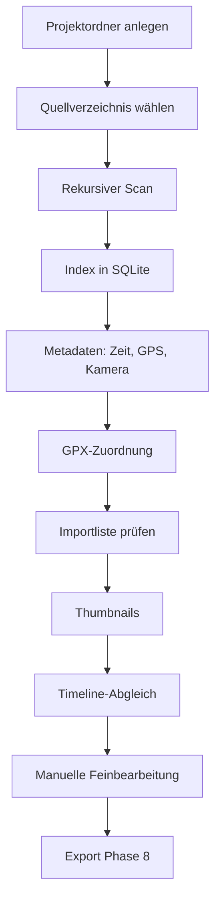

# Konzept — Reisetagebuch

| Feld | Inhalt |
| --- | --- |
| Version | 0.7 |
| Stand | 27. August 2026 |
| Status | Leitkonzept; Phase 7 erweitert, Software **R1.0.0** |
| Bezug | [pflichtenheft.md](pflichtenheft.md), [architecture.md](architecture.md), [packaging/README.md](../packaging/README.md) |

Dieses Dokument beschreibt die **Idee, den Ablauf und die technische Leitlinie**. Verbindliche Soll-Aussagen stehen im Pflichtenheft.

---

## 1. Produktidee

Reisende kommen mit einem Ordner voller Fotos, Videos, GPS-Tracks und Notizen nach Hause. Die Anwendung erzeugt daraus zuerst ein **Grundgerüst** — chronologisch, geografisch, mit erkennbaren Aufenthalten — und überlässt die Wahrheit dem Menschen: korrigieren, umsortieren, Texte schreiben, Fotos wählen.

Das Vorbild ist der *Workflow* von Polarsteps (Reise als Spur aus Orten und Momenten), nicht ein Online-Dienst. Es gibt kein Konto, keinen automatischen Upload, keine stillschweigende Cloud.

Zwei Nutzungswelten teilen denselben Kern:

| Anwendung | Fokus |
| --- | --- |
| **Reisetagebuch** (`traveljournal`) | Reise rekonstruieren, bearbeiten, exportieren |
| **PhotoInspector** (später) | Dubletten, Qualität, Auswahl — ohne Reisesemantik |

Deshalb liegt jede Analyse in `travelcore` und **nicht** in Qt-Widgets.

---

## 2. Leitprinzipien

1. **Originale sind heilig.** Die App liest Quelldateien nur. Schreiben geschieht ausschließlich im Projektordner.
2. **Vorschlag vor Entscheidung.** Automatik erzeugt `origin=auto`. Sobald der Benutzer eingreift, wird `origin=manual`. Automatik überschreibt manuelle Daten nicht still.
3. **Quelle der Wahrheit ist nachvollziehbar.** Jede Aufnahmezeit und jede Koordinate trägt ihre Herkunft (EXIF, QuickTime, Dateisystem, GPX-Interpolation/`gpx_nearest`, manuell).
4. **Keine falsche Präzision.** Fehlt die Zeitzone, bleibt sie unbekannt — es wird nicht „UTC“ unterstellt.
5. **Eine defekte Datei ist ein Datensatz, kein Absturz.**
6. **Lokal zuerst.** Externe Dienste nur nach ausdrücklicher Aktion.
7. **Schnittstellen vor konkreten Engines.** Metadaten, Karte, Export, Ranking und PDF-Rendering sind austauschbar.
8. **Keine toten Abhängigkeiten.** Eine Bibliothek wird erst installiert, wenn Code sie aufruft.

---

## 3. Nutzer und typische Abläufe

### 3.1 Erstimport einer Reise



Der Benutzer sieht während des Imports Fortschritt und danach **die vollständige Dateiliste** mit Aufnahmezeit, GPS und Kamera. Klick oder Mouseover auf eine Zeile zeigt das gecachte Vorschaubild und die gespeicherten Metadaten. Die Statistik (Fotos, Videos, Tracks, Texte, Fehler) und die Tabelle müssen dieselbe Grundmenge beschreiben. Nach dem Import entsteht automatisch die Timeline; Karte und Galerie lesen denselben Index.

### 3.2 Wiederholter Import

Dieselbe Quelle erneut analysieren:

- unveränderte Dateien (Größe + mtime + vorhandener Hash) nicht neu hashen
- fehlende GPS-/Kamera-/EXIF-Zeit nachziehen, wenn der Parser inzwischen mehr kann
- neue Dateien ergänzen
- defekte Dateien als Fehler zählen, Rest fortsetzen

### 3.3 Bearbeitung (Phase 7, Software R1.0.0)

Das Grundgerüst entsteht **automatisch nach dem Import**, nicht als zweite Wahrheit in der Oberfläche.

- **Ein Reisetag je Kalendertag** der Aufnahmezeit (`captured_at.date()`). Medien ohne Zeit landen unter „Ohne Datum“.
- **Reiseabschnitte** legt der Benutzer in der Timeline an: Aufenthalt oder Transfer, aus einer Mehrfachauswahl von Fotos, Videos und Tracks. Dateien ohne Abschnitt bleiben **Tage**. Der Typ (Tag, Transfer, Aufenthalt) ist an jeder Timeline-Karte änderbar. Neu angelegte Abschnitte existieren nur im Speicher, bis **Speichern**. **Zur Karte** an einem gespeicherten Abschnitt oder Tag öffnet die Karte und fokussiert die passende Karte in der Leiste.
- **Der Reisetitel** steht oben in der Timeline. Zuerst gilt der Projektname; nach **Speichern** ist er manuell und überlebt den erneuten Abgleich.
- **Fotos werden nicht umgehängt.** Die Aufnahmezeit bleibt der Tag. Das Flag `used_in_journal` (Filter **Nicht im Tagebuch** auf der Medienseite) ändert die Zugehörigkeit nicht — wer ein Foto einem anderen Tag zuordnen will, ändert die Zeit nicht still, sondern wartet auf eine spätere, explizite Korrektur.
- **Ortsvorschläge** entstehen aus GPS-Fotos desselben Tages: greedy Cluster mit Haversine, Radius 150 m (`stay_radius_meters`). Sie bleiben unbestätigt (`origin=auto`), bis der Benutzer sie benennt, bestätigt oder löscht. Hat ein Tag bereits Orte, legt der Abgleich keine zweiten Auto-Orte an.
- **Manuelle Daten überleben den Re-Sync:** Titel, Tagesetext, bestätigte Orte, Favoriten, Sortierstatus, Titelbild und `used_in_journal` tragen `origin=manual`. Die Automatik überschreibt sie nicht. Anzeigedrehung (`rotation_degrees`) überlebt den Re-Import.
- **Die Timeline** ist die Bearbeitungsoberfläche: sie mischt Tage, Transfers und Aufenthalte, schreibt Titel und Texte, setzt Bewertungen (dieselben wie auf der Medienseite) und Eintrags-Titelbilder (Foto oder Track), speichert YouTube erst mit Speichern und DHV-Leonardo-Links an gespeicherten Einträgen sofort. Die Karte zeigt dieselben Einträge als Titelbilder plus eine Leiste darunter (Tag mit Kalendersymbol, Transfer als liegendes Sechseck, Aufenthalt als bisherige Karte); zwischen Tag- und Aufenthaltskreisen verbindet eine Linie mit Richtungsmarker die Positionen, solange sie sich nicht überdecken. Die Detailansicht liest dieselben Orte und blendet die Verbindungslinien aus. Einfachklick in der Leiste zentriert, Doppelklick öffnet den Eintrag in der Timeline.
- **Medieninspektor:** In der Timeline öffnet ein Doppelklick ein eigenes Fenster mit dem Original. Auf der Karte zeigt ein Klick auf ein Foto zuerst ein kleines Thumbnail-Popup; Doppelklick auf das Thumbnail öffnet denselben Inspektor. Liegen Fotos in der Detailansicht sehr nah beieinander, werden sie gestapelt (Anzahl auf dem Marker); ab Zoom 17 liegen sie einzeln, auch wenn sie sich überdecken. Blättern in der Sequenz des Tags/Abschnitts, Zoom, freie Fenstergröße, Vollbild mit schwarzen Rändern, Anzeigedrehung ohne Originalschreiben.

### 3.4 PhotoInspector (später)

Öffnet keine Reisestruktur, sondern Medienbestände. Nutzt Hashing, Ähnlichkeit und Qualitätswerte aus `travelcore`. Darf Originale ebenfalls nicht ändern oder löschen.

---

## 4. Informationsarchitektur der Oberfläche

Linke Navigation, rechts der Arbeitsbereich. Sechs Seiten in Pipeline-Reihenfolge: Projekt, Import, Medien, Timeline, Karte, Export.

| Seite | Rolle im Konzept |
| --- | --- |
| **Projekt** | Behälter: Name, Ordner, Öffnen/Anlegen. Keine Medienbearbeitung. |
| **Import** | Brücke zur Außenwelt. Einzige Stelle, die das Quellverzeichnis scannt. |
| **Medien** | Medienarbeit vor der Chronik: Galerie, Filter, Register Alle/Favoriten/Reserve/Aussortiert, Bewertungen, Inspektor. Qualität und Dubletten folgen später. |
| **Timeline** | Chronologische und narrative Bearbeitung: Reisetitel, Tage, Transfers und Aufenthalte, Typwahl, Titel/Text, Bewertungen, Eintrags-Titelbild, YouTube/DHV-Leonardo, Medieninspektor. |
| **Karte** | Geografische Wahrheit: ein runder Kreis je Tag, Transfer oder Aufenthalt; zwischen Tag- und Aufenthaltskreisen Verbindungslinien mit Richtung in Timeline-Reihenfolge (ausgeblendet, wenn sich die Kreise überdecken). Klick auf den Kreis zeigt Fotos, Videos, Tracks und Orte dieses Eintrags. Die Leiste unter der Karte folgt dem Reiseverlauf — Einfachklick zentriert bei gleichem Zoom, Doppelklick öffnet die Timeline. Ohne Eintrags-Titelbild das erste Foto mit GPS, sonst der erste GPS-Track. Backend austauschbar. |
| **Export** | Ausgabe, keine Analyse. Phase 8: HTML. |

Lange Arbeit (Index, Thumbnails, Qualität) läuft im GUI-Prozess über Worker, die **nur** synchrone `travelcore`-Funktionen aufrufen. Die Bibliothek kennt keine Qt-Threads. CPU-Arbeit (Hash, Metadaten, Vorschaubilder) parallelisiert `travelcore` intern per Prozess-Pool; SQLite bleibt ein Schreiber.

---

## 5. Fachliches Datenmodell

### 5.1 Schichten der Reise

```
Reise
 └── Reisetag
      └── Reiseabschnitt
           └── Ort / Aufenthalt
                └── Ereignis
                     ├── Medienobjekt (Foto/Video)
                     └── Textnotiz
```

Ortsnamen müssen in Version 1 nicht „perfekt“ sein. Die Struktur muss sie aber schon tragen, damit Automatik und Handarbeit dieselbe Hierarchie nutzen. **Reiseabschnitte** legt der Benutzer in der Timeline an (Aufenthalt / Transfer). Sie gehören zur Chronologie, nicht zur automatischen Import-Gruppierung. Tage ohne Abschnitt bleiben tageszentriert.

### 5.2 Position als eigener Fakt

Eine Position ist nie nur ein Koordinatenpaar. Sie hat:

- Quelle (`exif`, `quicktime`, `photo_nearest`/`photo_interpolated`, `gpx_interpolated`/`gpx_nearest`, `igc_interpolated`/`igc_nearest`, `manual`)
- Konfidenz (1.0 bei direktem EXIF/ISO-6709; geringer bei Interpolation)
- optional Zeitdifferenz zum Track

Damit kann die UI später erklären: „aus dem Foto“ versus „aus der Uhrzeit auf dem GPX“.

### 5.3 Zeit als eigener Fakt

Gespeichert werden:

- Rohstring aus der Datei
- normalisierter Zeitpunkt
- Quellenname gemäß Prioritätsliste
- Zeitzonenname oder `timezone_unknown=true`

Dateisystemzeit ist letzter Fallback, nie stillschweigend als Aufnahmezeit ausgegeben ohne Kennzeichnung.

### 5.4 Projektordner

SQLite ist die Arbeitsdatei, nicht das Archiv der Bilder. Thumbnails und Analyseergebnisse liegen neben der Datenbank, damit das Projekt kopierbar bleibt. Die Quellwurzel der Originale steht in `settings.toml` (Projekt → Einstellungen), zusammen mit GPS-Zeitfenster, Standardzeitzone, Kartenanbieter (`leaflet` / `offline`) und der Farbe der Verbindungslinien auf der Karte (Standard weiß). Wird der Ordner verschoben, setzt man den neuen Pfad; der Index wird umgeschrieben, die Originaldateien nicht. Zuletzt geöffnete Projekte merkt die App unter `%LOCALAPPDATA%\TravelJournal\recent.json`; die Liste erscheint noch nicht in der Oberfläche. Das Medienregister (`timeline_media_tab`, Timeline und Medienseite) und der Projekte-Stammordner liegen in `config.json`. Der Fenstertitel zeigt die Softwareversion (`Reisetagebuch R1.0.0` bzw. mit Projekttitel).

---

## 6. Metadatenkonzept

Pillow liest JPEG/TIFF/WebP/PNG. HEIC öffnet Pillow in dieser Umgebung nicht; ExifTool ist optional und oft nicht installiert.

Deshalb liest `travelcore` HEIC **containerbasiert, nur lesend**:

1. Eingebettetes EXIF-TIFF (`Exif\0\0` bzw. gültiger TIFF-Kopf) → GPS-IFD (inkl. Blickrichtung), Make/Model, DateTimeOriginal, Brennweite / 35-mm-Äquivalent
2. QuickTime/Apple ISO 6709 (`com.apple.quicktime.location.ISO6709`)
3. UTF-8-`data`-Boxen (Make/Model, typisch iPhone)
4. Optional ExifTool, falls vorhanden — füllt nur Lücken

Metadatenboxen in HEIC können **hinter** dem Bilddatenblock stehen. Ein Scan nur der ersten Megabytes ist konzeptionell falsch; gelesen wird die Datei vollständig (mit oberer Schutzgrenze und Kopf/Ende bei Extremgrößen).

RAW bleibt im Index ein Foto; tiefe Metadaten hängen an ExifTool. Videozeit hängt an einem späteren ffprobe-Adapter.

GPX-Tracks werden nach dem Dateiindex gelesen (gpxpy) und als Punkte mit Segment und Zeit gespeichert. Unveränderte GPX/IGC (Größe, mtime, Hash) werden nicht erneut geparst und nicht neu in SQLite geschrieben, sofern bereits Trackpunkte existieren. IGC-Fluglogs (Gleitschirm) werden ebenfalls gelesen: B-Records als Trackpunkte, Pilot aus dem Header, optionaler DHV-Leonardo-Link am Track (beim Re-Import erhalten). Die Trackdatei selbst bekommt eine repräsentative Position (arithmetisches Mittel der ersten Trackpunkte) und die Zeit des ersten Punkts mit `recorded_at` (`gpx_track` / `igc_track`). Originale bleiben unverändert. Fotos und Videos ohne geschützte EXIF-/QuickTime-Position erhalten eine Position in dieser Reihenfolge: (1) zeitnahes anderes Foto mit GPS, (2) GPX, (3) IGC, jeweils interpoliert oder nächster Punkt innerhalb `gps_match_max_delta_seconds` (Standard 120). Quellen: `photo_interpolated`/`photo_nearest`, `gpx_interpolated`/`gpx_nearest`, `igc_interpolated`/`igc_nearest`, nie `exif`. Foto-, Video-, GPX- und IGC-Positionen bekommen keinen Ortsnamen; auf der Karte steht das Datum.

Naive Aufnahmezeiten ohne Offset werden nur für diesen Vergleich mit `default_timezone` des Projekts oder andernfalls UTC in Einklang mit GPX/IGC gebracht. Das Flag `timezone_unknown` an der Datei bleibt. KML (LineString / gx:Track) und GeoJSON (LineString) werden für Track-Vorschauen geparst; sie fließen nicht in die GPS-Zuordnung und nicht in die interaktive Karte.

Vorschaubilder entstehen beim Import in `thumbnails/` als quadratische JPEGs (Standard 256 px). Die Importliste wird während des Einlesens periodisch geschrieben und angezeigt, nach dem GPX-Abgleich noch einmal, erst danach laufen die Thumbnails. JPEG/PNG/WebP/TIFF liest Pillow. HEIC nutzt unter Windows dieselbe Vorschau wie der Explorer (`IShellItemImageFactory` / WIC, HEIF Image Extensions), sonst ein JPEG-Item oder ein eingebettetes JPEG im Container — ohne libheif und ohne GPL-Codecs. GPS-Tracks (GPX/IGC/KML/GeoJSON) zeichnen die Spur rot auf einem OSM-Kartenausschnitt (`cache/map_tiles`); ohne Kacheln bleibt der Hintergrund schwarz. Die Galerie zeigt diese Caches, nicht die Originale. Ein zweiter Lauf überspringt vorhandene Dateien.

Anzeigedrehung ist ein Index-Fakt (`source_files.rotation_degrees`, 0/90/180/270). Sie greift nach der EXIF-Orientierung, nur auf Vorschau und Inspektor. Originale werden nicht geschrieben. Der Thumbnail-Cachepfad enthält die Drehung (`_r90`), damit ein Re-Import die Nutzerdrehung nicht überschreibt.

---

## 7. Technische Leitarchitektur

Details und Paketschnitt: [architecture.md](architecture.md).

```
apps/traveljournal     UI, Worker, keine Fachregeln
        │
        ▼
packages/travelcore    Scan, Index, Metadaten, GPS, Timeline, Karte, Export, DB
        ▲
apps/photoinspector    geplant, dieselbe Bibliothek
```

Wichtige Verträge (bereits angelegt, schrittweise gefüllt):

| Vertrag | Zweck |
| --- | --- |
| `MetadataProvider` | Pillow, ExifTool, später ffprobe |
| `Exporter` | HTML, PDF, LaTeX, CEWE |
| `MapBackend` | Folium zuerst, später ersetzbar |
| `RankingStrategy` | Foto-Score ohne fest verdrahtete Formel |

Persistenz: SQLAlchemy 2, Alembic, eine SQLite-Datei je Projekt. Migrationen sind Teil des Produkts, nicht nur der Entwicklung.

Nebenläufigkeit: Progress-Callbacks in `travelcore`, Qt-Threads nur in der App. CPU-Pools in der Bibliothek, SQLite seriell.

### 7.1 Verteilung an Endnutzer

Zwei Betriebsarten, dieselbe Fachlogik:

| Wer | Start |
| --- | --- |
| Entwicklung | Python 3.12-venv, `python -m traveljournal` |
| Endnutzer (Windows) | `Reisetagebuch.exe` aus dem Frozen-Ordner, dem Zip oder dem optionalen Inno-Setup |

Das Frozen-Paket ist **onedir** (Ordner plus EXE), nicht eine einzige Datei: Qt WebEngine (Karte) und der ProcessPool (`spawn`) sind so zuverlässiger. Der Frozen-Einstieg `packaging/entry.py` ruft `multiprocessing.freeze_support` auf, **ohne** `traveljournal.main` zu ändern — sonst würden Worker-Prozesse weitere GUI-Fenster öffnen.

Die Installation (Setup) schreibt nur nach `%LOCALAPPDATA%\Programs\Reisetagebuch`. Reiseprojekte bleiben eigene Ordner; App-Einstellungen bleiben unter `%LOCALAPPDATA%\TravelJournal`. Originale liegen weiterhin außerhalb des Installationsordners.

**Nicht** im Paket: ExifTool, HEIF Image Extensions, FFmpeg. **Nicht** vorgesehen: macOS (WIC-Vorschauen, `%LOCALAPPDATA%`). PySide6 bleibt dynamisch gelinkt (LGPL); `NOTICE.txt` liegt im Paket. Eine Code-Signatur fehlt noch — SmartScreen kann die unsignierte EXE beim ersten Start beanstanden.

Build: [packaging/README.md](../packaging/README.md).

---

## 8. Exportkonzept

Export ist eine **Abbildung des bearbeiteten Tagebuchs**, nicht des Rohimports.

- **HTML zuerst:** eigenständige Seite, Jinja2, CSS getrennt, optional Karte.
- **PDF:** nicht über AGPL-Zwang (kein PyMuPDF als zentrale Abhängigkeit). Pfad HTML→Druckengine oder LaTeX→PDF hinter `PdfRenderer`.
- **LaTeX:** kompilierbares Projekt; der PDF-Lauf darf extern bleiben.
- **CEWE:** Schnittstelle und Platzhalter, bis das echte Format geprüft ist. Keine geratenen proprietären Binärformate.

---

## 9. Qualität, Ähnlichkeit, Ranking

Technische Qualität ist eine **Empfehlung**. Sie entscheidet nie über Löschen.

Ähnlichkeit ist eine eigene, GUI-freie Komponente:

- exakt: SHA-256
- visuell: dHash/pHash (später optionale Embeddings)

Ranking aggregiert Qualität, Schärfe, Auflösung, Einzigartigkeit und eine Dublettenstrafe. Die Formel ist eine Strategy, damit PhotoInspector und das Tagebuch unterschiedliche Gewichte nutzen können, ohne die Datenhaltung zu spalten.

---

## 10. Datenschutz und Lizenzrahmen

Standard: alles lokal. Kartenkacheln kommen optional von OpenStreetMap (`leaflet` in den Projekteinstellungen, Kacheln von openstreetmap.de mit deutschen bzw. lateinischen Namen). Gelände nutzt OpenTopoMap, Satellit Esri World Imagery (Netzwerk, jeweilige Attribution). `offline` zeichnet nur Track und Marker, ohne Kacheln. Reverse-Geocoding bleibt OP-01.

Abhängigkeiten: MIT/BSD/Apache bevorzugt, PySide6 unter LGPL mit dynamischem Linken. Das Windows-Endnutzerpaket enthält LICENSE und `NOTICE.txt`. Jede direkte Bibliothek steht in [dependencies.md](dependencies.md). Persönliche GPS-Koordinaten gehören nicht ins Git-Repository; Tests verwenden synthetische Werte (z. B. Bozen als dokumentiertes Beispiel ohne Bezug zu echten Nutzerfotos). Build-Artefakte (`dist/`, `build/`) gehören nicht ins Git.

---

## 11. Phasenlogik

Nicht das ganze Polarsteps-Abbild auf einmal. Jede Phase bleibt startbar und testbar.

| Phase | Konzeptueller Gewinn |
| --- | --- |
| 1–2 | Es gibt ein Projekt und einen Index. |
| 3 | Der Index hat eine zeitliche und geografische Bedeutung. |
| 4 | Fotos ohne EXIF-GPS stehen trotzdem auf der Spur. |
| 5 | Die Menge wird betrachtbar. |
| 6 | Die Reise wird räumlich erzählbar. |
| 7 | Der Mensch übernimmt die Redaktion (Abschnitte, Bewertungen, Inspektor). |
| 8 | Die Reise verlässt die App. |
| 9–10 | Die Auswahl wird begründet (Qualität, Dubletten). |

Aktueller Konzeptstand: **Phase 7 erweitert**, Software **R1.0.0** (Timeline mit Abschnitten, Bewertungen, Inspektor, Track-Vorschauen, Karten-Leiste und Kreis-Detail). Windows-Endnutzerpaket (onedir/Zip, optional Inno-Setup) ist baubar und keine eigene Fachphase. HTML-Export folgt in Phase 8.
